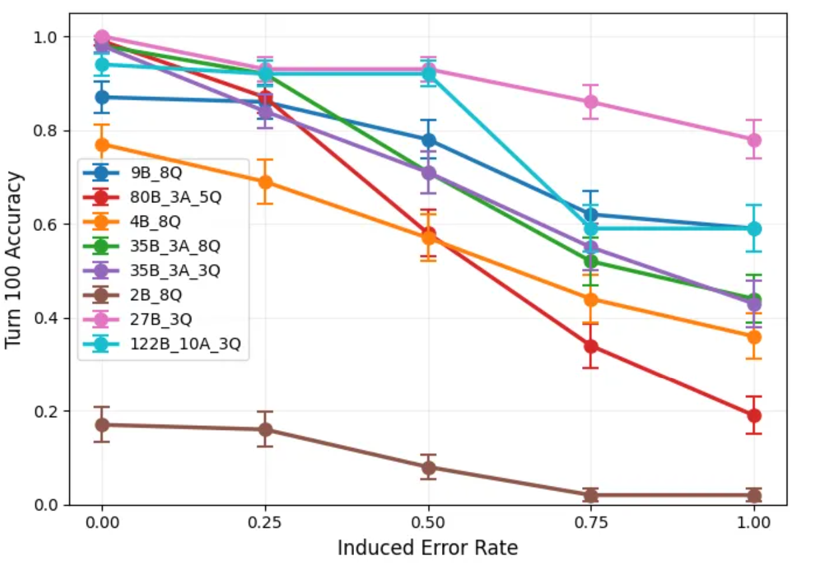
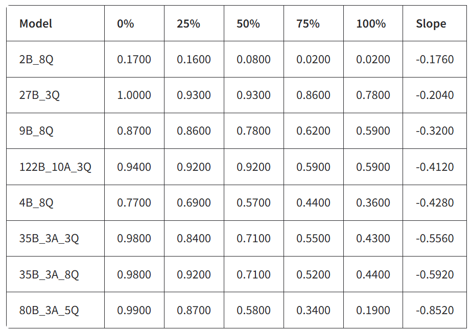

# Vibe Coding Project: Long Horizon Execution Benchmark

> Paper: "The Illusion of Diminishing Returns: Measuring Long Horizon Execution in LLMs"  
> Repo: https://github.com/long-horizon-execution/measuring-execution  
> Dataset: https://huggingface.co/datasets/arvindh75/Long-Horizon-Execution


## Mission

Reproduce the two core experiments from the paper and extend them with modern models:

1. **Standard execution benchmark** — measures how turn accuracy degrades as task length increases across model sizes (Figures 3/4 in the paper)
2. **Self-conditioning experiment** — injects artificial error histories at varying rates (0%, 25%, 50%, 75%, 100%) and measures turn accuracy at turn 100 (Figure 5 in the paper)


## Experiments

Models tested (naming: `{total_params}B_{active_params}A_{quant}Q`, MoE models have an `A` suffix):

| File | Model | Type | Quant |
|---|---|---|---|
| `self_conditioning_2B_8Q` | Qwen3.5-2B | Dense | Q8 |
| `self_conditioning_4B_8Q` | Qwen3.5-4B | Dense | Q8 |
| `self_conditioning_9B_8Q` | Qwen3.5-9B | Dense | Q8 |
| `self_conditioning_27B_3Q` | Qwen3.5-27B | Dense | Q3 |
| `self_conditioning_35B_3A_8Q` | Qwen3.5-35B-A3B | MoE | Q8 |
| `self_conditioning_35B_3A_3Q` | Qwen3.5-35B-A3B | MoE | Q3 |
| `self_conditioning_80B_3A_5Q` | Qwen3-Coder-Next-80B-A3B | MoE | Q5 |
| `self_conditioning_122B_10A_3Q` | Qwen3.5-122B-A10B | MoE | Q3 |


## Results





### Analysis

Self-conditioning results across all tested models (sorted by slope, least susceptible first):

| Model | 0% | 25% | 50% | 75% | 100% | Slope |
|---|---|---|---|---|---|---|
| 2B_8Q | 0.17 | 0.16 | 0.08 | 0.02 | 0.02 | −0.176 |
| 27B_3Q | 1.00 | 0.93 | 0.93 | 0.86 | 0.78 | −0.204 |
| 9B_8Q | 0.87 | 0.86 | 0.78 | 0.62 | 0.59 | −0.320 |
| 122B_10A_3Q | 0.94 | 0.92 | 0.92 | 0.59 | 0.59 | −0.412 |
| 4B_8Q | 0.77 | 0.69 | 0.57 | 0.44 | 0.36 | −0.428 |
| 35B_3A_3Q | 0.98 | 0.84 | 0.71 | 0.55 | 0.43 | −0.556 |
| 35B_3A_8Q | 0.98 | 0.92 | 0.71 | 0.52 | 0.44 | −0.592 |
| 80B_3A_5Q | 0.99 | 0.87 | 0.58 | 0.34 | 0.19 | −0.852 |

**Key observations:**

- **27B_3Q is the most robust** — despite aggressive 3-bit quantization, it shows the least degradation with error injection (slope −0.204). Its accuracy at 100% error rate (0.78) still exceeds the 0% baseline of 2B (0.17) and 4B (0.77), though it falls well below the other models' baselines.
- **Smaller MoE models degrade sharply** — 80B_3A_5Q starts at near-perfect accuracy (0.99) but collapses to 0.19 at 100% error rate (slope −0.852), the steepest drop of all models. The 35B_3A variants follow a similar pattern (slopes −0.556 and −0.592). However, the largest MoE model 122B_10A_3Q is notably more resilient (slope −0.412), ranking 4th overall.
- **122B_10A_3Q shows a step-function pattern** — it holds steady at 0.92 through 50% error rate, then drops sharply to 0.59 at 75% and plateaus there through 100%. This is distinct from the linear degradation seen in other models.
- **Quantization effect (35B_3A)** — comparing 35B_3A_8Q vs 35B_3A_3Q, the 8-bit model is slightly more susceptible (−0.592 vs −0.556), suggesting minimal quantization impact on self-conditioning behavior.
- **2B_8Q fails the task** — the 2B model barely solves the benchmark at 0% error (0.17), making its self-conditioning slope misleading; it is simply unable to perform the task regardless.
- **Baseline accuracy does not predict robustness** — models with the highest 0% accuracy (80B at 0.99, 35B variants at 0.98) are among the most susceptible to self-conditioning, while 27B (1.00) and 122B (0.94) resist degradation far better. Architecture matters more than raw capability.


## Project Structure

```
main.py              # CLI entry point (argparse with standard / self-conditioning subcommands)
config.py            # ModelConfig and ExperimentConfig dataclasses
dataset.py           # Dictionary + key sequence generation with ground truth
prompts.py           # System prompt construction (matches paper Appendix E)
llm_client.py        # OpenAI-compatible client for llama.cpp server
experiment.py        # Standard + self-conditioning experiment runners (ThreadPoolExecutor)
evaluation.py        # Answer parsing, turn/task accuracy, horizon length (H_0.5)
ui.py                # Gradio dashboard for plotting results
words_alpha.txt      # 101 five-letter words (from the paper's repo)
pyproject.toml       # uv project config (openai, numpy, gradio, matplotlib)
output/              # Timestamped JSON result files
```


## Usage

```bash
# Install dependencies
uv sync

# Standard execution benchmark (Figures 3/4)
uv run main.py standard --num-samples 100 --num-turns 100

# Self-conditioning experiment (Figure 5)
uv run main.py self-conditioning --num-samples 100 --eval-turn 100

# Adjust turn complexity (K keys per turn)
uv run main.py standard --working-capacity 2 --num-turns 100

# Control parallelism
uv run main.py standard --num-workers 4

# Launch results dashboard
uv run ui.py
# Opens at http://127.0.0.1:7860
```

## For Coding Agents

### Coding
- Use uv
- Always add multi-line docstrings to the top of files


## Data
- Use the llama.cpp server with the model `lmstudio-community/Qwen3.5-9B-Q8_0.gguf`
- Server is running at `http://0.0.0.0:8080`